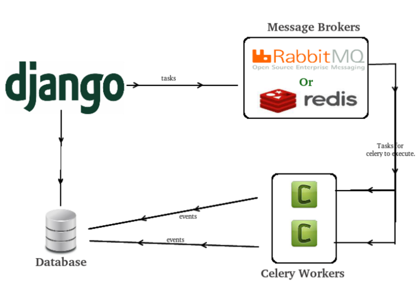
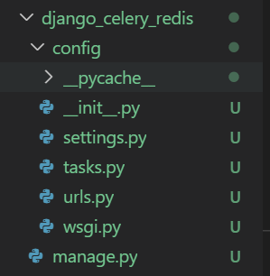

## Django에서 Celery + Redis를 이용한 비동기 작업



- Celery는 안보는 곳에서 일하는 (백그라운드)일꾼이다. 처리해야 할 일을 Queue로 쌓아둔다. 큐에 쌓인 일을 일꾼들이 가져다가 열심히 일을 한다
- Redis는 실제 컴퓨터 메모리를 이용한 캐쉬다. Key와 Value값을 이용해 처리할 작업을 Celery에게 보낸 다음 캐쉬 시스템에서 해당 키를 없애는 방식으로 동작한다

### Project 생성

```bash
#가상환경 설정
$ source ~/venv/Scripts/activate 

#폴더 생성
$ mkdir django_celery_redis

#TIL2/django_celery_redis 프로젝트 폴더 설정
$ django-admin startproject config .

```

### Celery 설치

```bash
#celery 모듈과 redis와의 연동을 위한 dependency를 한번에 설치
$ pip install 'celery[redis]'
```

### Redis 설치하기

```shell
#Redis 설치하기 (Linux)
$ wget http://download.redis.io/redis-stable.tar.gz
$ tar xvzf redis-stable.tar.gz
$ cd redis-stable
$ make
$ redis-server # redis 실행$ redis-cli ping # 정상 설치되었는지 확인> PONG
```

`PONG` 메시지를 띄우면 설치 성공이다.

- Redis 설치하기(Window) => [참고 링크](../Redis/redis.md)

### 폴더 구조



### tasks.py 파일 생성

```python
import os
from celery import Celery
 
# `celery` 프로그램을 작동시키기 위한 기본 장고 세팅 값을 정한다. 
os.environ.setdefault('DJANGO_SETTINGS_MODULE', 'config.settings')
 
app = Celery('config')
 
# namespace='CELERY'는 모든 셀러리 관련 구성 키를 의미한다. 반드시 CELERY라는 접두사로 시작해야 한다. 
app.config_from_object('django.conf:settings', namespace='CELERY')
 
# 장고 app config에 등록된 모든 taks 모듈을 불러온다. 
app.autodiscover_tasks()
 
@app.task
def add(x, y):
    return x + y

```

### settings.py 에 내용추가

```python
CELERY_BROKER_URL = 'redis://localhost:6379/0'
CELERY_RESULT_BACKEND = 'redis://localhost:6379/0'
CELERY_ACCEPT_CONTENT = ['application/json']
CELERY_RESULT_SERIALIZER = 'json'
CELERY_TASK_SERIALIZER = 'json'
```


### __init__.py 수정

```python
from .tasks import app as celery_app
 
__all__ = ['celery_app']
```


### celery 실행

```bash
#celery -A <mysite> worker -l info
celery -A config worker --loglevel=info
```


**Cannot connect 문제가 발생한다면**

BROKER_URL 또는 RESULT_BACKEND를 잘못 지정해줬을 가능성이 있다

settings.py 파일에 CELERY_BROKER_URL, CELERY_RESULT_BACKEND 확인


- **실행결과**

```bash
kyung@DESKTOP-KGB9UAE MINGW64 /c/TIL2/django_celery_redis (master)
$ celery -A config worker --loglevel=info

 -------------- celery@DESKTOP-KGB9UAE v4.3.0 (rhubarb)      
---- **** -----
--- * ***  * -- Windows-10-10.0.18362-SP0 2019-12-05 23:11:34
-- * - **** ---
- ** ---------- [config]
- ** ---------- .> app:         config:0x3fee4f0
- ** ---------- .> transport:   redis://localhost:6379/0     
- ** ---------- .> results:     redis://localhost:6379/0
- *** --- * --- .> concurrency: 8 (prefork)
-- ******* ---- .> task events: OFF (enable -E to monitor tasks in this worker)
--- ***** -----
 -------------- [queues]
                .> celery           exchange=celery(direct) key=celery


[tasks]
  . config.tasks.add

[2019-12-05 23:11:37,394: INFO/MainProcess] Connected to redis://localhost:6379/0
[2019-12-05 23:11:38,379: INFO/SpawnPoolWorker-3] child process 54296 calling self.run()
[2019-12-05 23:11:38,405: INFO/SpawnPoolWorker-5] child process 56604 calling self.run()
[2019-12-05 23:11:38,526: INFO/SpawnPoolWorker-1] child process 53912 calling self.run()
[2019-12-05 23:11:38,721: INFO/SpawnPoolWorker-6] child process 49696 calling self.run()
[2019-12-05 23:11:38,915: INFO/SpawnPoolWorker-2] child process 14220 calling self.run()
[2019-12-05 23:11:39,075: INFO/SpawnPoolWorker-7] child process 54888 calling self.run()
[2019-12-05 23:11:39,135: INFO/SpawnPoolWorker-8] child process 30924 calling self.run()
[2019-12-05 23:11:39,318: INFO/SpawnPoolWorker-4] child process 46896 calling self.run()
[2019-12-05 23:11:41,556: INFO/MainProcess] mingle: searching for neighbors
[2019-12-05 23:11:49,163: INFO/MainProcess] mingle: all alone
[2019-12-05 23:11:57,371: INFO/MainProcess] celery@DESKTOP-KGB9UAE ready.
```

### Shell에서 Celery를 이용한 작업처리

- celery를 실행시킨 상태에서 터미널 하나를 더 추가한 뒤 작업 진행

```bash
#TIL2/django_celery_redis (master)
$ python manage.py shell
Python 3.8.0 (tags/v3.8.0:fa919fd, Oct 14 2019, 19:21:23) [MSC v.1916 32 bit (Intel)] on win32
Type "help", "copyright", "credits" or "license" for more information.
(InteractiveConsole)
>>> from config.tasks import add
>>> result = add.delay(4,4)
>>> result = add.delay(4,4)
>>> result = add.delay(4,4)
```
- celery shell을 확인해보면 **Received task** 라는 메시지와 함께 실행된 것을 확인 할 수 있다

