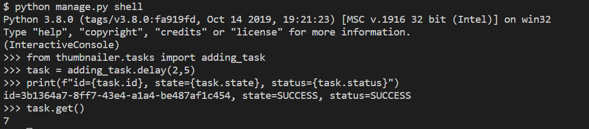
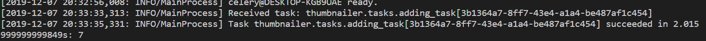

## Django기반 비동기 썸네일 기능 구현

- 환경: Python 3.8.0

### Install Python Virtual Env and Dependencies

```bash
$ mkdir image_parroter
$ cd image_parroter
$ python -m venv venv #가상환경생성
$ source venv/Scripts/activate
```


```bash
(venv) $ pip install Django Celery redis Pillow django-widget-tweaks
(venv) $ pip freeze > requirements.txt
```

### Setting Up the Django Project

```bash
#TIL2/image_parroter (master)
$ django-admin startproject config .
$ python manage.py startapp thumbnailer
```


```python
#settings.py
INSTALLED_APPS = [
    ...
    'thumbnailer',
    'widget_tweaks',
]

LANGUAGE_CODE = 'ko' #언어설정

TIME_ZONE = 'Asia/Seoul' #시간설정

# celery
# celery
CELERY_BROKER_URL = 'redis://localhost:6379/1'
CELERY_RESULT_BACKEND = 'redis://localhost:6379/1'
CELERY_ACCEPT_CONTENT = ['application/json']
CELERY_RESULT_SERIALIZER = 'json'
CELERY_TASK_SERIALIZER = 'json'
```

- celery 실행 
  - window의 경우 --pool=solo 옵션추가

```bash
(venv) $ celery worker -A config --loglevel=info --pool=solo
```

- python shell로 테스트

```bash
$ python manage.py shell
Python 3.8.0 (tags/v3.8.0:fa919fd, Oct 14 2019, 19:21:23) [MSC v.1916 32 bit (Intel)] on win32
Type "help", "copyright", "credits" or "license" for more information.
(InteractiveConsole)
>>> from thumbnailer.tasks import adding_task
>>> task = adding_task.delay(2,5)
>>> print(f"id={task.id}, state={task.state}, status={task.status}")
id=3b1364a7-8ff7-43e4-a1a4-be487af1c454, state=SUCCESS, status=SUCCESS
>>> task.get()
7
```
- shell 결과

- celery 로그



