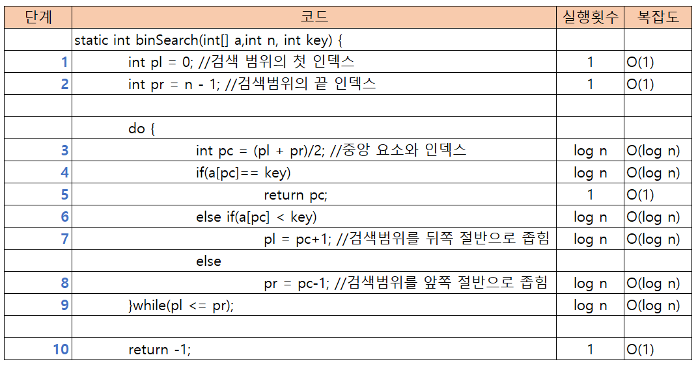

## 검색

### 이진 검색

>  이진검색(binary search)는 요소가 오름차순 또는 내림차순으로 정렬된 배열에서 검색하는 알고리즘 입니다.

- 아래 그림에서 오름차순으로 정렬된 데이터에서 `39`를 검색하는 과정을 생각해 보겠습니다. 먼저 배열의 중앙에 위치한 요소인 a[5] 부터 검색을 시작합니다.

- 검색하려는 값인 `39`는 중앙요소 a[5]보다 큰값입니다. 그러므로 검색 대상을 뒤쪽에 5개로 좁힐 수 있습니다. 그럼 다음 검색 범위의 중앙에 위치한 요소인 a[8]이 원하는 값인지 확인합니다.

- 검색하려는 값인 `39`보다 큰 값입니다. 그러므로 검색 대상을 앞쪽의 2개로 좁힐 수 있습니다. 이제 검색해야하는 대상은 2개 입니다. 이때 두개의 중앙 요소는 39나 58중에 아무거나 선택해도 상관없지만 여기서 앞쪽의 값 39를 선택하여 원하는 값인지 확인합니다.

- 39는 원하는 값과 일치하므로 검색이 완료됩니다.

- [예제소스](https://github.com/kyunghee2/TIL2/blob/master/Java/java_algorithm/src/chap03/BinSearch.java)

#### 복잡도

> 알고리즘의 성능을 객관적으로 평가하는 기준을 복잡도(complexity) 라고 합니다.
>
> 복잡도는 아래의 두가지 요소를 가지고 있습니다.

> 1. 시간 복잡도(time complexity): 실행에 필요한 시간을 평가하는 것
> 2. 공간 복잡도(space complexity): 기억 영역과 파일 공간이 얼마나 필요한가를 평가한 것

- 복잡도를 표기할때 사용하는 O는 Order에서 따온 것으로 O(n)은 'O - n', 'Order n', 'n의 Order'라고 읽습니다.

- 이진 검색 알고리즘의 복잡도를 구하면 O(log n)을 얻을 수 있습니다.

- O(1) + O(1) + O(log n) .... O(1) = O(log n)

#### Arrays.binarySearch에 의한 이진 검색

- Java는 배열에서 이진 검색을 하는 메서드를 표준 라이브러리로 제공
- 이진 검색 표준 라이브러리의 메서드로는 java.util.Arrays 클래스의 binarySearch메서드가 있습니다.
- Java API 공식 문서 참고(https://docs.oracle.com/javase/8/docs/api)

