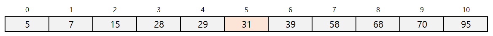
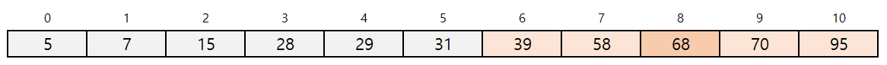
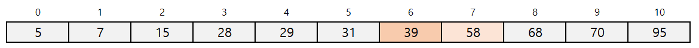

## 검색

### 이진 검색

>  이진검색(binary search)는 요소가 오름차순 또는 내림차순으로 정렬된 배열에서 검색하는 알고리즘 입니다.

- 아래 그림에서 오름차순으로 정렬된 데이터에서 `39`를 검색하는 과정을 생각해 보겠습니다. 먼저 배열의 중앙에 위치한 요소인 a[5] 부터 검색을 시작합니다.



- 검색하려는 값인 `39`는 중앙요소 a[5]보다 큰값입니다. 그러므로 검색 대상을 뒤쪽에 5개로 좁힐 수 있습니다. 그럼 다음 검색 범위의 중앙에 위치한 요소인 a[8]이 원하는 값인지 확인합니다.



- 검색하려는 값인 `39`보다 큰 값입니다. 그러므로 검색 대상을 앞쪽의 2개로 좁힐 수 있습니다. 이제 검색해야하는 대상은 2개 입니다. 이때 두개의 중앙 요소는 39나 58중에 아무거나 선택해도 상관없지만 여기서 앞쪽의 값 39를 선택하여 원하는 값인지 확인합니다.



- 39는 원하는 값과 일치하므로 검색이 완료됩니다.

- 예제코드
```java
package chap03;
//이진검색

import java.util.Scanner;

public class BinSearch {
	static int binSearch(int[] a,int n, int key) {
		int pl = 0; //검색 범위의 첫 인덱스
		int pr = n - 1; //검색범위의 끝 인덱스
		
		do {
			int pc = (pl + pr)/2;//중앙 요소와 인덱스
			if(a[pc]== key)
				return pc;
			else if(a[pc] < key)
				pl = pc+1;//검색범위를 뒤쪽 절반으로 좁힘
			else
				pr = pc-1;//검색범위를 앞쪽 절반으로 좁힘
		}while(pl <= pr);
		
		return -1;
	}
	public static void main(String[] args) {
		Scanner stdln = new Scanner(System.in);
		
		System.out.print("요소수:");
		int num = stdln.nextInt();
		int[] x = new int[num];
		System.out.println("오름차순으로 입력하세요");
		
		System.out.print("x[0]:");
		x[0]=stdln.nextInt();
		
		for(int i=1;i <num;i++) {
			do {
				System.out.print("x["+i+"]:");
				x[i] = stdln.nextInt();
			}while(x[i] < x[i-1]);//바로 앞요소 보다 작으면 다시 입력
		}
		System.out.print("검색할 값:");
		int ky = stdln.nextInt();
		
		int idx = binSearch(x,num,ky);
		if(idx == -1)
			System.out.println("그값의 요소가 없습니다.");
		else
			System.out.println(ky+"은 x["+idx+"]에 있습니다.");
	}
}

```

