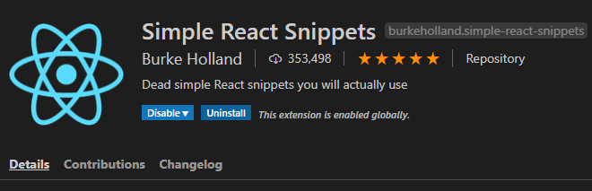

## React

> 리액트(React)는 페이스북이 개발하고 있는 UI 라이브러리 입니다.
>
> 웹 페이지 내부의 각 부분을 컴포넌트로 다룰 수 있게 해주며, 컴포넌트를 HTML태그로 작성할 수 있게 해주는 JSX를 사용하며, 가상 DOM(Virtual DOM)을 사용해 렌더링 성능을 극대화 함

### 개발환경

- VS Code
- VS Code - Extensions 탭 - simple react snippets 설치




### 리액트 시작하기

```html
<!DOCTYPE html>
<html lang="en">
<head>
  <meta charset="UTF-8">
  <meta name="viewport" content="width=device-width, initial-scale=1.0">
  <meta http-equiv="X-UA-Compatible" content="ie=edge">
  <title>Document</title>

  <script crossorigin src="https://unpkg.com/react@16/umd/react.development.js"></script>
  <script crossorigin src="https://unpkg.com/react-dom@16/umd/react-dom.development.js"></script>
  <script src="https://cdnjs.cloudflare.com/ajax/libs/babel-core/5.8.38/browser.min.js"></script>
<body>
  <div id="root"></div>

  <script type="text/babel">
  //리액트로 DOM의 내용을 변경
  ReactDOM.render(
  <h1>Hello, world!</h1>,
  document.getElementById('root')
);
  </script>
</body>
</html>
```


### 리액트 컴포넌트 생성

1. HTML 파일에 DOM 요소 추가

   ```html
   <!-- ... existing HTML ... -->
   
   <div id="like_button_container"></div>
   
   <!-- ... existing HTML ... -->
   ```

   

2. 스크립트 태그 추가

   - 사이트를 배포할 때는 "development.js"를 "production.min.js"로 대체
   
   ```html
    ...
     <!-- React를 실행. -->
     <script src="https://unpkg.com/react@16/umd/react.development.js" crossorigin></script>
     <script src="https://unpkg.com/react-dom@16/umd/react-dom.development.js" crossorigin></script>
   
     <!-- 만든 React 컴포넌트를 실행. -->
     <script src="like_button.js"></script>
   
   </body>
   ```

3. React 컴포넌트 생성

   - like_button.js 파일생성

   ```javascript
   'use strict';
   
   const e = React.createElement;
   
   class LikeButton extends React.Component {
     constructor(props) {
       super(props);
       this.state = { liked: false };
     }
   
     render() {
       if (this.state.liked) {
         return 'You liked comment number ' + this.props.commentID;
       }
   
       return e(
         'button',
         { onClick: () => this.setState({ liked: true }) },
         'Like'
       );
     }
   }
   
   // Find all DOM containers, and render Like buttons into them.
   document.querySelectorAll('.like_button_container')
     .forEach(domContainer => {
       // Read the comment ID from a data-* attribute.
       const commentID = parseInt(domContainer.dataset.commentid, 10);
       ReactDOM.render(
         e(LikeButton, { commentID: commentID }),
         domContainer
       );
     });
   ```

   

- index.html 전체소스

```html
<!DOCTYPE html>
<html>
  <head>
    <meta charset="UTF-8" />
    <title>Add React in One Minute</title>
  </head>
  <body>

    <h2>Add React in One Minute</h2>
    <p>This page demonstrates using React with no build tooling.</p>
    <p>React is loaded as a script tag.</p>

    <p>
      This is the first comment.
      <!-- We will put our React component inside this div. -->
      <div class="like_button_container" data-commentid="1"></div>
    </p>

    <p>
      This is the second comment.
      <!-- We will put our React component inside this div. -->
      <div class="like_button_container" data-commentid="2"></div>
    </p>

    <p>
      This is the third comment.
      <!-- We will put our React component inside this div. -->
      <div class="like_button_container" data-commentid="3"></div>
    </p>

    <!-- Load React. -->
    <!-- Note: when deploying, replace "development.js" with "production.min.js". -->
    <script src="https://unpkg.com/react@16/umd/react.development.js" crossorigin></script>
    <script src="https://unpkg.com/react-dom@16/umd/react-dom.development.js" crossorigin></script>

    <!-- Load our React component. -->
    <script src="like_button.js"></script>

  </body>
</html>
```

### 리액트와 JSX의 관계

#### JSX 태그 내부에 변수를 넣는 방법

```html
<!DOCTYPE html>
<html lang="en">
<head>
  <meta charset="UTF-8">
  <meta name="viewport" content="width=device-width, initial-scale=1.0">
  <meta http-equiv="X-UA-Compatible" content="ie=edge">
  <title>Document</title>
  <script crossorigin src="https://unpkg.com/react@16/umd/react.development.js"></script>
  <script crossorigin src="https://unpkg.com/react-dom@16/umd/react-dom.development.js"></script>
  <script src="https://cdnjs.cloudflare.com/ajax/libs/babel-core/5.8.38/browser.min.js"></script>
</head>
<body>
  <div id="root"></div>
  <script type="text/babel">
  const title = "서예"
  const imgUrl = "http://www.dobongn.kr/wp-content/uploads/1/cfile1.uf.11726F334F432C1815EEF9.jpg"
  //jsx로 요소 정의
  const msg = <div>
                <h1>{title}</h1>
                <p></p>
              </div>
  //render()로 렌더링
  const elm  =document.getElementById("root")
  ReactDOM.render(msg,elm)
  </script>
</body>
</html>
```

#### JSX로 스타일 속성 지정하기

- 스타일 속성을 객체로 지정

```
const obj = {prop1:value1, prop2:value2, prop3:value3...}
const dom = <tag style={obj}...</tag>
```

- 실습

```html
<!DOCTYPE html>
<html lang="en">
<head>
  <meta charset="UTF-8">
  <meta name="viewport" content="width=device-width, initial-scale=1.0">
  <meta http-equiv="X-UA-Compatible" content="ie=edge">
  <title>Document</title>
  <script crossorigin src="https://unpkg.com/react@16/umd/react.development.js"></script>
  <script crossorigin src="https://unpkg.com/react-dom@16/umd/react-dom.development.js"></script>
  <script src="https://cdnjs.cloudflare.com/ajax/libs/babel-core/5.8.38/browser.min.js"></script>
</head>
<body>
  <div id="root"></div>

  <script type="text/babel">
  ReactDOM.render(
  getDOM(),
  document.getElementById('root')
);
//요소를 반환하는 함수
function getDOM(){
  const css1 ={
    "color":'red',
    "background-color":'#f0f0ff',
    "font-size":'2em'
  }
  const css2={
    color:'blue',
    backgroundColor:'#fff0f0',
    fontSize:'2em'
  }
  return (
    <div>
      <p style={css1}>죄는 미워하되 사람은 미워하지 말라</p>
      <p style={css2}>이것 또한 지나가리라</p>
    </div>
  )
}
  </script>
</body>
</html>
```


### 가상 DOM 

> 가상 DOM은 DOM의 상태를 메모리에 저장하고 변경 전과 변경 후의 상태를 비교한 뒤 필요한 최소한의 내용만 반영하는 기능 입니다.

> DOM 변경을 최소한으로 만들어 주므로 성능 상승시켜줌

### 리액트로 컴포넌트 만들기

- 컴포넌트(Component)란 특정 기능을 가진 범용적인 '부품'을 나타내는 용어. 소프트웨어 개발을 할 때는 일반적으로 수많은 컴포넌트를 조합하게 됩니다.

#### 리스트 컴포넌트

```react
...
<script type="text/babel">
  //리스트컴포넌트 정의
  
  class RList extends React.Component {
    render(){
      const items = this.props.items.split(",")
      const itemsObj = items.map(
        (e)=>{
          return <li>{e}</li>
        })
      let title = this.props.title
      if(!title) title="LIST"
      //렌더링할 내용을 반환
      return (
        <div>
          <h3>{title}</h3>
          <ul>{itemsObj}</ul>
        </div>
      )
    }
    
  }
  //컴포넌트 출력
  ReactDOM.render(
      <RList title="Colors" items="Red,Green,Blue,White" />,
      document.getElementById('root')
    )
  </script>
```


#### 화살표 함수로 컴포넌트 정의

```react
<!DOCTYPE html>
<html lang="en">
<head>
  <meta charset="UTF-8">
  <meta name="viewport" content="width=device-width, initial-scale=1.0">
  <meta http-equiv="X-UA-Compatible" content="ie=edge">
  <title>Document</title>
  <script crossorigin src="https://unpkg.com/react@16/umd/react.development.js"></script>
  <script crossorigin src="https://unpkg.com/react-dom@16/umd/react-dom.development.js"></script>
  <script src="https://cdnjs.cloudflare.com/ajax/libs/babel-core/5.8.38/browser.min.js"></script>
</head>
<body>
  <div id="root"></div>
  <script type="text/babel">
  const TitleParts = (props) => (
    <div style={{backgroundColor:'blue',color:'white'}}>
      <h3>{props.title}</h3>
    </div>
  )
  const ContentParts = (props)=>(
    <div>
      <div>줄거리:{props.body}</div>
    </div>
  )
  //메인 컴포넌트
  const Book = (props)=>(
    <div>
      <TitleParts title={props.title}/>
      <ContentParts body={props.body}/>
    </div>
  )
  //리액트로 DOM의 내용을 변경
  ReactDOM.render(
    (<div>
      <Book title='삼국지' body='옛날 중국 이야기'/>
      <Book title='민수기' body='옛날 이스라엘 이야기'/>
      <Book title='멋진신세계' body='미래 이야기'/>
    </div>),
    document.getElementById('root')
  )
  </script>
</body>
</html>
```

