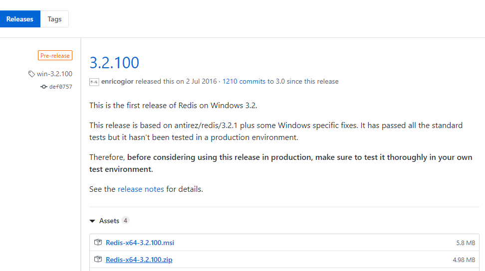
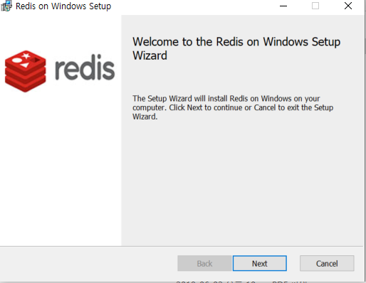
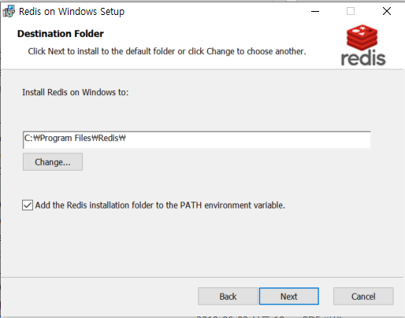
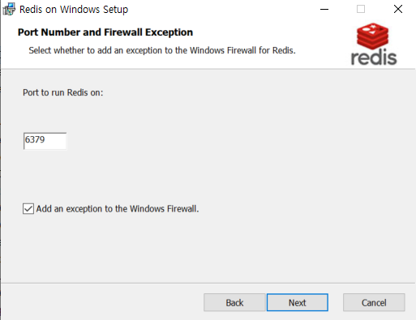
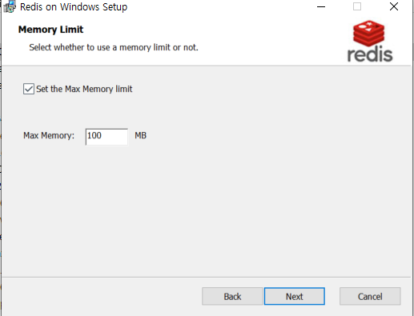
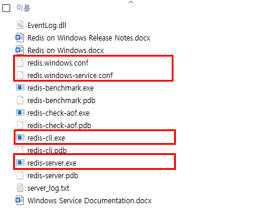
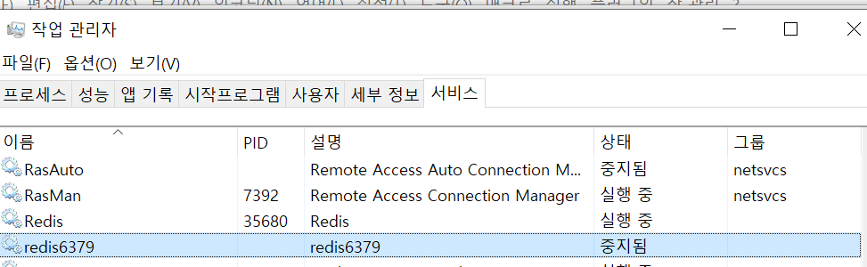
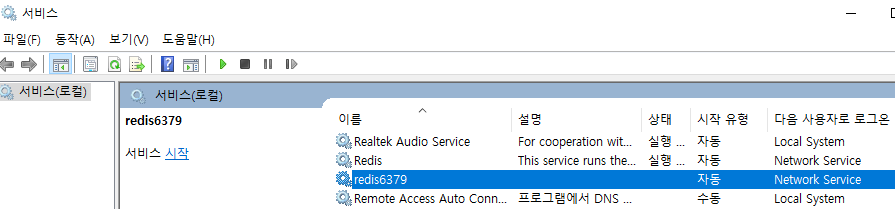
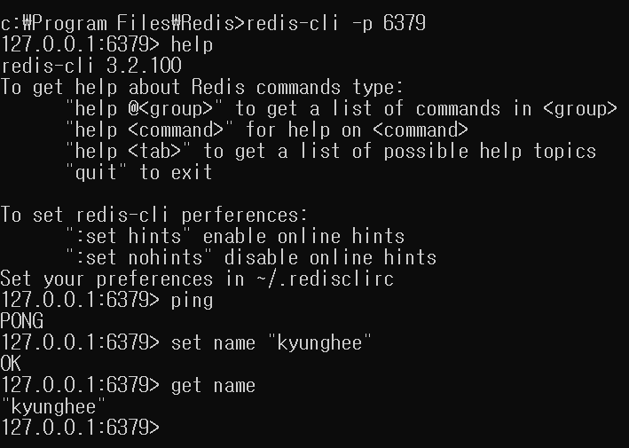
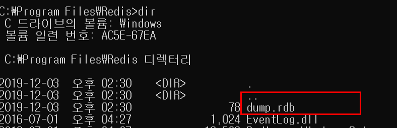

## Redis(Remote Directory System)

- 키밸류(KeyValue) 데이터베이스로 분류되는 NoSQL이며, 2009년 Salvatore Sanfilippo가 처음 개발

  2005년 부터 RedisLabs co.에 의해 상용 SW가 개발되어 지원되고 있다

- 키밸류 DB이면서 In Memory 기반의 데이터 처리 및 저장 기술을 제공하기 때문에 상대적으로 빠른 Read/Write가 가능

- String, Set, Sorted Set, Hash, List, HyperLog유형의 데이터를 저장가능

- Master/Slave Replication 기능을 통해 데이터 분산, 복제 기능을 제공하며 Query Off Loading기능을 통해 Master는 Read/Write를 수행하고 Slave는 Read만 수행할 수 있다

- 파티셔닝을 통해 동적인 스케일 아웃(Scale Out)인 수평 확장이 가능하다

- Expriation기능은 일정 시간이 지났을 때 메모리 상의 데이터를 자동 삭제 할 수 있다


## Redis 설치(Linux)

Download, extract and compile Redis with:

```
$ wget http://download.redis.io/releases/redis-5.0.7.tar.gz
$ tar xzf redis-5.0.7.tar.gz
$ cd redis-5.0.7
$ make
```

The binaries that are now compiled are available in the `src` directory. Run Redis with:

```
$ src/redis-server
```

You can interact with Redis using the built-in client:

```
$ src/redis-cli
redis> set foo bar
OK
redis> get foo
"bar"
```

## Redis 설치(Window)

- https://github.com/microsoftarchive/redis/releases 사이트에서 
- Redis-x64-3.2.100.msi Window용 다운로드 및 설치



- Next 



- 시스템 Path에 설정 체크박스 체크



- 기본포트 6379, 윈도우즈 방화벽에 예외처리체크박스 체크



- Redis 서버가 사용할 수 있는 최대 메모리 크기 설정



- 설치가 완료되면 아래와 같은 파일을 확인 할 수 있다
  - redis.windows.conf 파라메터 파일
  - redis-server.exe 인스턴스 시작 실행 파일



## Redis 시작과 종료(Linux)

- Redis Server 시작

```bash
$ cd /home/redis/src
$ ./redis-server redis_5000.conf
```

- Redis Client 실행 및 종료

```bash
$ cd /home/redis/src
$ ./redis-cli -p 5000 #port 5000으로 redis 서버 접속

#종료
120.0.0.1:5000 > shutdown
```


## Redis 시작과 종료(Window)

#### redis 서버 서비스로 등록

- 관리자 권한으로 Redis 폴더내에서 명령프롬프트(cmd.exe) 실행

```bash
#파일명변경
\path\to\Redis> move redis.windows-service.conf redis.conf
#Redis 서버를 시작하는 작업이 윈도우 서버가 시작될때 마다 자동으로 실행되도록 등록
\path\to\Redis> redis-server --service-install redis.conf --service-name redis6379
```

- 작업관리자 - 서비스텝에서 확인가능



- 제어판 - 서비스 에서 확인가능



#### redis-cli를 통해 Redis 서버 접속

```
\path\to\Redis> redis-cli -p 6379
```



- 명령어 목록 https://redis.io/commands 참고

## Redis 데이터 처리

#### 데이터 입력/수정/삭제/조회

- set : 데이터를 저장할 때(key, value)
- get : 저장된 데이터를 검색할 때
- rename : 저장된 데이터 값을 변경할 때
- rendomkey : 저장된 key 중에 하나의 key를 랜덤하게 검색할 때
- keys : 저장된 모든 key를 검색할 때
- exits : 검색 대상 key가 존재하는지 여부를 확인 할 때
- mset/ mget : 여러개의 key와 value를 한 번 저장하고 검색할 때
- del :  저장된 데이터 삭제

##### 실습

```cmd
#key:1111, value:KH PARK 데이터 저장
127.0.0.1:6379> set 1111 "KH PARK"
OK
127.0.0.1:6379> set 1112 "YH JOO"
OK
127.0.0.1:6379> set 1113 "KO HONG"
OK

#현재 저장되어 있는 모든 키 출력
127.0.0.1:6379> keys *
1) "name"
2) "1113"
3) "1112"
4) "1111"

#key:name 삭제
127.0.0.1:6379> del name
(integer) 1

127.0.0.1:6379> keys *
1) "1113"
2) "1112"
3) "1111"
#key중이 2로 끝나는 key만 검색
127.0.0.1:6379> keys *2
1) "1112"

#key:1113에서 key:1116으로 변경
127.0.0.1:6379> rename 1113 1116
OK
#현재 저장되어 있는 모든키 조회
127.0.0.1:6379> keys *
1) "1116"
2) "1112"
3) "1111"

#key:1116의 존재 여부 검색 (존재:1)
127.0.0.1:6379> exists 1116
(integer) 1
127.0.0.1:6379> exists 115
(integer) 0
#key:1111의  value  길이
127.0.0.1:6379> strlen 1111
(integer) 7
127.0.0.1:6379> keys 1111
1) "1111"
127.0.0.1:6379> get 1111
"KH PARK"
```


```cmd
127.0.0.1:6379> mset seq_no 201912001 #연속번호 발행을 위한 key/value저장
OK
127.0.0.1:6379> incr seq_no #incremental 증가값 +1
(integer) 201912002
127.0.0.1:6379> decr seq_no #decremental 감소값 -1
(integer) 201912001
127.0.0.1:6379> incrby seq_no 2 #incremental 증가값 +2
(integer) 201912003
127.0.0.1:6379> decrby seq_no 10 #decremental 감소값 -10
(integer) 201911993

127.0.0.1:6379> append 1115 " co."
(integer) 7
127.0.0.1:6379> keys *
1) "1116"
2) "seq_no"
3) "1115"
4) "1113"
5) "1111"
6) "1112"
127.0.0.1:6379> get 1115
"PIT co."
127.0.0.1:6379> save
OK
127.0.0.1:6379> flushall
OK
127.0.0.1:6379> keys *
(empty list or set)
127.0.0.1:6379> info
# Server
redis_version:3.2.100
redis_git_sha1:00000000
redis_git_dirty:0
redis_build_id:dd26f1f93c5130ee
redis_mode:standalone
os:Windows
arch_bits:64
multiplexing_api:WinSock_IOCP
process_id:35680
run_id:f0aa3c8c632262d58b60021358b0264d22893fb8
tcp_port:6379
uptime_in_seconds:144385
uptime_in_days:1
hz:10
lru_clock:15070081
.....
127.0.0.1:6379> exit
```

- save 명령어에 의해 생성된 rdb 파일



